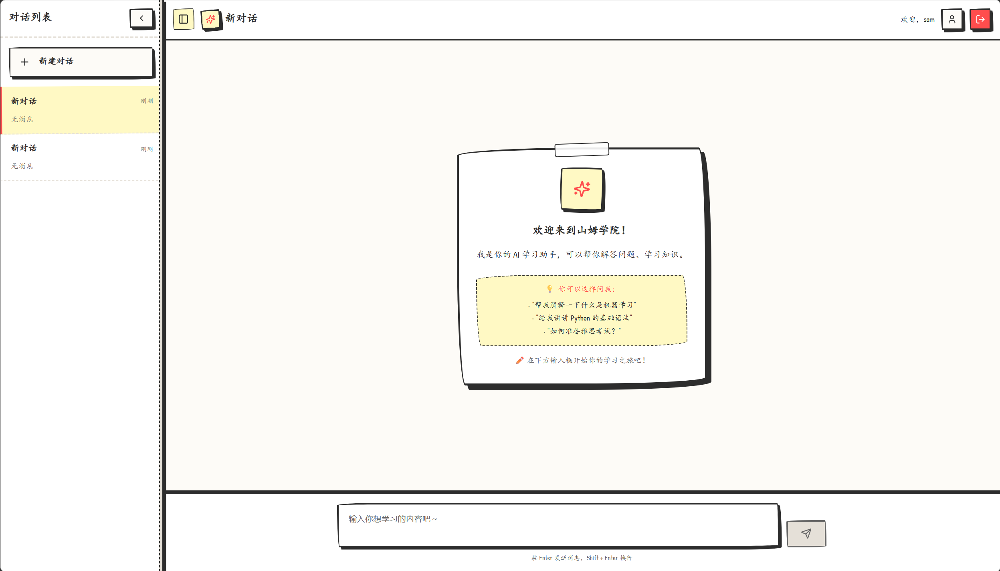
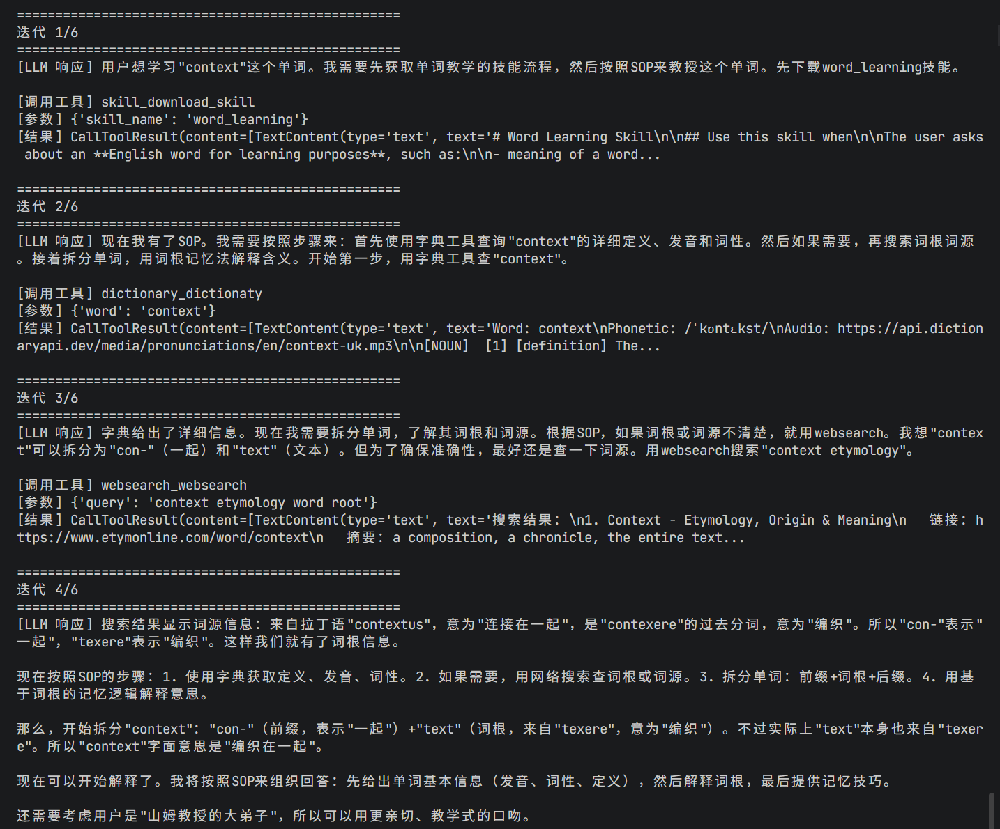
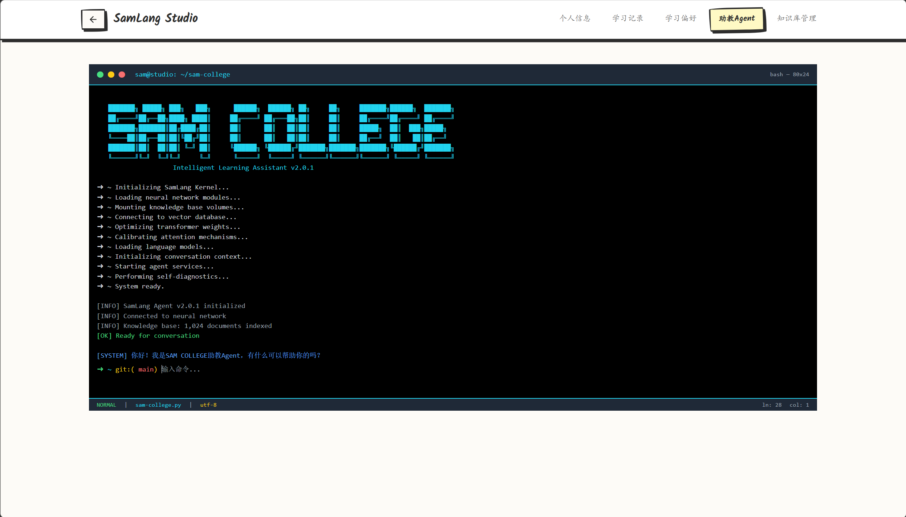
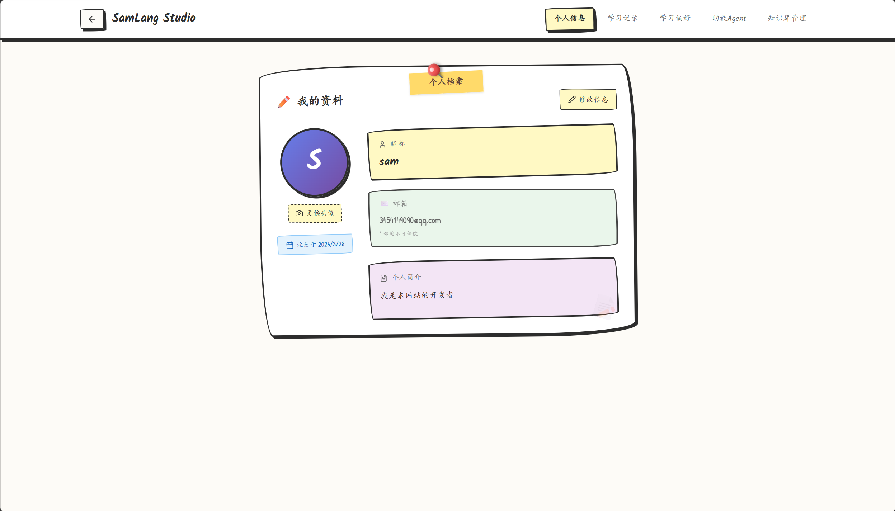

# SamLang

一个专注于英语学习的AI+教育智能体，依赖于skill驱动，可灵活拓展驱动skill。

## 🌟 产品特性

- 🤖 **ReACT Agent** - AI自主决策教学方案
- 🔧 **MCP 工具集成** - 内置词典、搜索等多种外部工具
- 📚 **技能系统** - 核心教学依赖，可扩展的技能学习框架
- 🎯 **专注语言学习** - 优化的外语学习体验

## 📁 项目核心结构

```
SamLang/
├── src/                # 核心模块
│   ├── agent/         # 对话 Agent
│   │   ├── agent.py   # ConversationAgent
│   │   ├── core/      # ReACT 核心算法
│   │   ├── mcp/       # MCP 工具集成
│   │   └── skills/    # 技能文件
│   ├── api/           # API 路由
│   ├── config/        # 配置管理
│   └── schemas/       # 数据模型
│
├── config.yaml         # 全局配置
├── .env.example        # 环境变量示例
├── main.py             # 应用入口
└── start.bat           # 一键启动脚本
```

## 🚀 快速开始

如果你不想自己安装，也可以让你的 CLaude code 或者 openclaw 阅读CLAUDE.md，帮你安装好环境，运行。

### 一键启动

**Windows:**
```bash
start.bat
```

这会启动 SamLang 后端服务。

### 手动启动（推荐使用uv管理环境）

**1. 安装依赖**
```bash
# 安装 Python 依赖（项目根目录）
uv sync
```

**2. 启动服务**
```bash
# 模块化运行
uv run -m main
```
服务将在 http://localhost:8000 运行

**3. 访问前端**

```bash
cd frontend
npm install
npm run dev
```
访问：http://localhost:5173

**主页**



**React循环执行**



**助教AGENT**



**用户配置**




### 终端使用
如果你不想使用前后端，可以在终端中使用，命令如下：

```bash
uv run -m src.main
```

在终端中，你会看到完整的react过程，读到SamLang教授的思考！！！

## 🎯 使用指南

### API 访问

后端启动后，可以访问：
- **Swagger UI**: http://localhost:8000/docs
- **ReDoc**: http://localhost:8000/redoc

## 🔧 核心配置

编辑 `config.yaml` 和 `.env`：

```yaml
# config.yaml
llm:
  model_name: deepseek-chat
  base_url: https://api.deepseek.com

agent:
  max_history: 20
```

```bash
# .env
DEEPSEEK_API_KEY=your_api_key_here
```

## 📡 API 端点

| 端点 | 方法 | 描述 |
|------|------|------|
| `/api/chat` | POST | 发送消息获取 AI 回复 |
| `/api/reset` | POST | 重置对话历史 |
| `/api/health` | GET | 健康检查 |
| `/docs` | GET | API 文档（Swagger） |

## 🛠️ 技术栈

- **后端**: FastAPI, Python 3.11+ (使用 uv 管理)
- **前端**: React
- **核心算法**: ReACT Agent, MCP（Model Context Protocol）, Skills
- **AI/LLM**: OpenAI 兼容接口，支持 DeepSeek、GPT-4 等模型（包括思考模型）

## 开发指南

### 新增技能

1. 在 `src/agent/skills/` 目录下创建新的技能文件（例如 `new_skill.py`），编写符合skill协议规范
2. 在 `config.yaml` 中启用新技能

### 自定义 LLM 模型

1. 编辑 `config.yaml` 中的 `llm` 配置
2. 确保 API key 已正确设置
3. 重启服务生效

### 新增工具

1. 在 `src/agent/mcp/` 目录下创建新的工具文件（例如 `new_tool.py`），编写符合MCP协议规范
2. 在 `config.yaml` 中启用新工具

## 🐛 故障排除

### 服务启动失败

1. 检查 `.env` 和 `config.yaml` 配置
2. 确认 API key 已正确设置
3. 运行 `uv sync` 确保依赖已安装

### 中文显示乱码

Windows 用户请确保：
1. 终端使用 UTF-8 编码
2. 已设置 `PYTHONIOENCODING=utf-8`


**开始使用 SamLang 提升你的语言学习体验！** 🎯✨